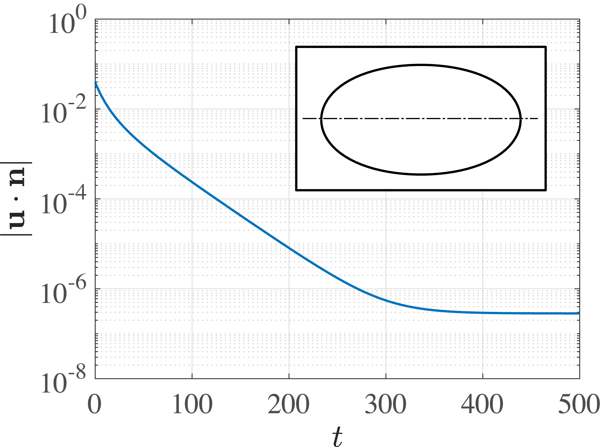

# DNS of one droplet using Spectral BIM

## Introduction

This tutorial show how to simulate the motion of a deformable droplet in an ambient fluid due to gravity or an extranally imposed flow, as an extensional flow. Find more info and validations in the reference below.

```
@techreport{gallino2018droplets,
  title={When droplets deform, break up and propel microswimmers},
  author={Gallino, Giacomo},
  year={2018},
  institution={EPFL}
}
```

## Non dimensional parameters

The problem is fully defined with the following non-dimensional parameters.

* Capillary number Ca=U mu_2/gamma, it sets the strenght of the imposed flow
* The viscosity ratio lambda=mu_1/mu_2 between inner and outer fluid.

In case of a droplet rising due to gravity, see the reference below for details regarding governing equations and non-dimensionalization.

```
@article{gallino2016stability,
  title={The stability of a rising droplet: an inertialess non-modal growth mechanism},
  author={Gallino, Giacomo and Zhu, Lailai and Gallaire, Fran{\c{c}}ois},
  journal={Journal of Fluid Mechanics},
  volume={786},
  year={2016},
  publisher={Cambridge University Press}
}
```

In case of a droplet in an extensioanl flow, see the reference below for details regarding governing equations and non-dimensionalization.

```
@article{gallino2018edge,
  title={Edge states control droplet breakup in subcritical extensional flows},
  author={Gallino, Giacomo and Schneider, Tobias M and Gallaire, Fran{\c{c}}ois},
  journal={Physical Review Fluids},
  volume={3},
  number={7},
  pages={073603},
  year={2018},
  publisher={APS}
}
```

## Run simulations

Run the script `tutorial_drop_spectral_dns.m` to perform simulations after having set the `REPOSITORY_NAME` variable to `path/to/easy-drop`. By default, it computes the deformation of an initially spherical droplet in an extensional flow when Ca=0.1 and lambda=5.

The script is densely commented and describes the main functionalities of the solver.

## Post-processing and results

Run the script `post_processing_dns_spectral.m` to perform post-processing after having run `tutorial_drop_spectral_dns.m ` and set the `REPOSITORY_NAME` variable to `path/to/easy-drop`.

The result of `tutorial_drop_spectral_dns.m ` is shown below. It shows the velocity residuals and the converged droplet shape. Low values of the residuals, calculated as velocity normal to the interface in the dropl frame, indicates a converged solution.


