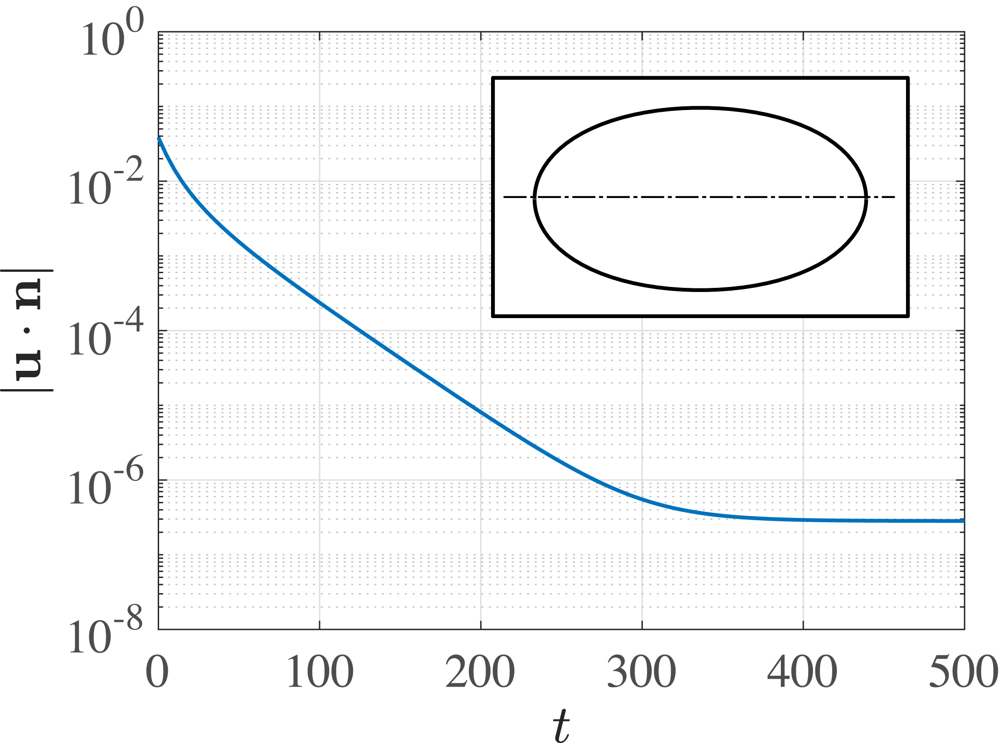
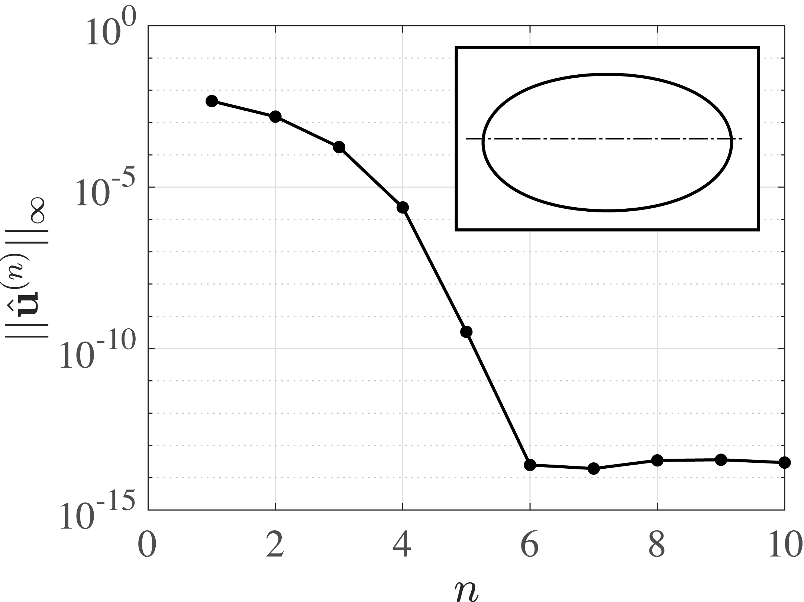
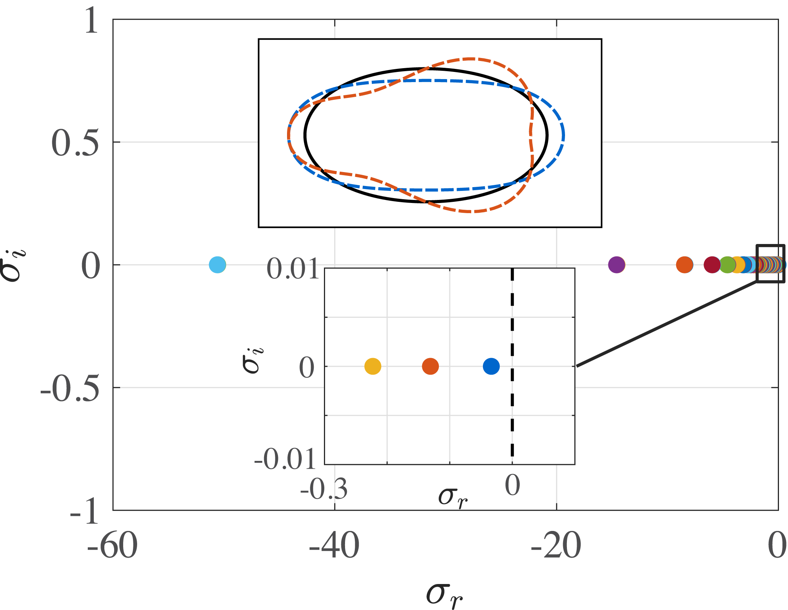
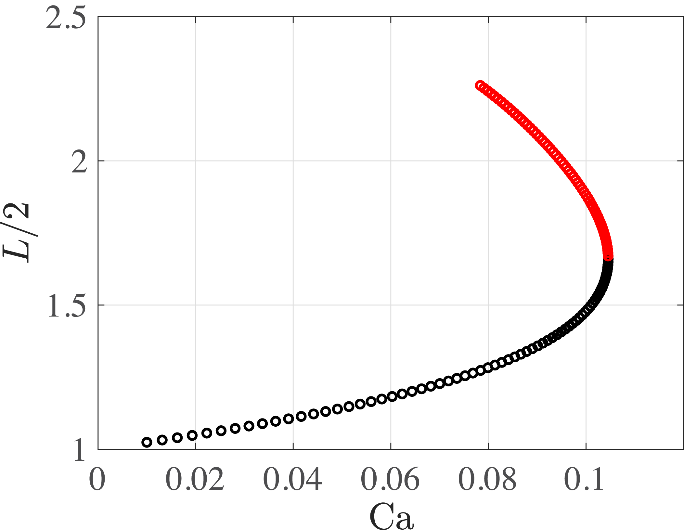
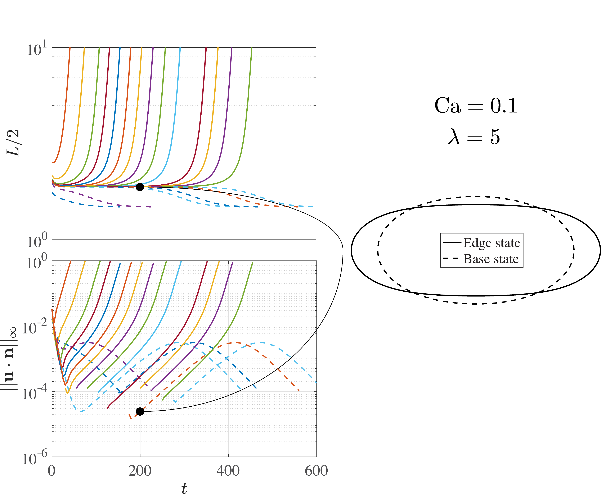

# One droplet using Spectral BIM

## Introduction

This tutorial shows how to simulate the motion of a deformable droplet in an ambient fluid due to gravity or an externally imposed flow, as an extensional flow. It shows different methods to solve the governing equations: direct numerical simulation (DNS), Newton Method, Continuation Method, Edge Tracking. Find more info and validations in the reference below.

```
@techreport{gallino2018droplets,
  title={When droplets deform, break up and propel microswimmers},
  author={Gallino, Giacomo},
  year={2018},
  institution={EPFL}
}
```

## Non dimensional parameters

The problem is fully defined with the following non-dimensional parameters.

* Capillary number Ca, it sets the strenght of the imposed flow
* The viscosity ratio lambda between inner and outer fluid.

In case of a droplet rising due to gravity, see the reference below for details regarding governing equations and non-dimensionalization.

```
@article{gallino2016stability,
  title={The stability of a rising droplet: an inertialess non-modal growth mechanism},
  author={Gallino, Giacomo and Zhu, Lailai and Gallaire, Fran{\c{c}}ois},
  journal={Journal of Fluid Mechanics},
  volume={786},
  year={2016},
  publisher={Cambridge University Press}
}
```

In case of a droplet in an extensional flow, see the reference below for details regarding governing equations and non-dimensionalization.

```
@article{gallino2018edge,
  title={Edge states control droplet breakup in subcritical extensional flows},
  author={Gallino, Giacomo and Schneider, Tobias M and Gallaire, Fran{\c{c}}ois},
  journal={Physical Review Fluids},
  volume={3},
  number={7},
  pages={073603},
  year={2018},
  publisher={APS}
}
```

## Direct numerical simulation (DNS)

Run the script `tutorial_dns.m` to perform simulations after having set the `REPOSITORY_NAME` variable to `path/to/easy-drop`. By default, it computes the deformation of an initially spherical droplet in an extensional flow when Ca=0.1 and lambda=5. The script is densely commented and describes the main functionalities of the solver.

Run the script `post_processing_dns_spectral.m` to perform post-processing after having run `tutorial_dns.m` and set the `REPOSITORY_NAME` variable to `path/to/easy-drop`. The result of `tutorial_dns.m` is shown below. It shows the velocity residuals and the converged droplet shape. Low values of the residuals, calculated as velocity normal to the interface in the dropl frame, indicates a converged solution.



## Newton method

The [Newton method](https://en.wikipedia.org/wiki/Newton%27s_method) is probably the best-known non time-marching method to solve nonlinear differential equations. It has two main advantages:

*  It converges to numerical precision fast.
*  It converges to steady solutions, no matter if stable or unstable.

Its main drawback compared to DNS is the need of computing the [Jacobian](https://en.wikipedia.org/wiki/Jacobian_matrix_and_determinant) of the time evolution equation, which might be mathematically involved and computationally expensive.

Run the script `tutorial_newton_method.m` to perform simulations after having set the `REPOSITORY_NAME` variable to `path/to/easy-drop`. By default, it computes the shape in an extensional flow when Ca=0.1 and lambda=5. Below the results, residuals over iterations and the converged shape.



## Stability analysis

Once the fixed point has been found with the Newton Method, it is insightful to study its [stability](Stability_theory) by computing the eigenvalues of the Jacobian. If positive eigenvalues are found, the fixed point is unstable. Run `tutorial_stability_analysys.m` to compute the eigenvalue spectra of the solution from the previous point. Below, see the eigenvalues spectra, since all eigenvalues are negative (the real part), the solution is stable. The inset shows the base state (solid black line) and the two least stable eignemodes overposed.



## Continuation method

Based on Newton method, one can perform [continuation method](https://en.wikipedia.org/wiki/Numerical_continuation) in order to compute fixed points of the equations vs changes in parameters. Here we implement [pseudo-arclength continuation](https://en.wikipedia.org/wiki/Numerical_continuation#Pseudo-arclength_continuation) in order to turn around bifurcations points in the bifurcation diagram.

Run `tutorial_continuation_method.m` to perform contination method varying the capillary number. Below, see the bifurcation diagram for and extensional flow for lambda=5, it plots the droplet half-length along the axis vs the capillary number. Black dots indicate stable solutions and red dots unstable ones. They meet in a saddle node bifurcation at Ca~0.1.



## Edge tracking

Edge tracking is a strategy that relies on DNS to track unstable solutions living on the boundaries of the basin of attraction, which separates stable from unstable trajectories of the dynamical system, so called edge states. The first step of edge stracking is to initialize two DNS simulations, one converging to the steady state (as the DNS previously shown in this tutorial) and the second developing instabilities, in this case leading to droplet breakup. Afterwards, a third simulation is initialized by bisecting the two trajectories. Iterating this processes, one eventually lands on the edge state.

Run `tutorial_edge tracking.m` to perform edge tracking, default values run edge tracking for Ca=0.1 and lambda=5. After running the script, run the post-processing with `post_processing_edge_tracking.m` to generate the graphs below. Below, see the trajectories of the dynamical system tracked with the droplet half-length along the axis. Performing bisection of the droplet shape when the trajectories depart from each others, we are able to approach the edge state. The low value of the residuals confirm the proximity to an (unstable) fixed point, the edge state.


